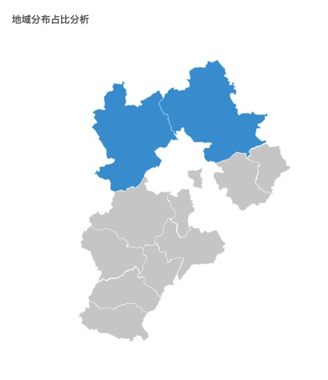
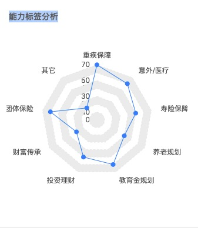

# PRD难点记录

## 前端
- 地图点击处理(全国->地区)

- 能力标签分析

- 大文件前端上传(文件切割)
- 消息展示怎么展示

## 后端
- 公司组织架构
- 消息通知
- 文件上传存储
- 导入文件之后怎么关联关系
- 权限系统协会设计
- 模板管理

## 疑惑

- 奖励模板渲染
- 流程审批需要动态更新
- 文件上传存储
- 处分内容这个textarea能不能满足
- 权限系统包含哪些  项目权限（操作权限 审批权限） 内容权限（协会权限等）